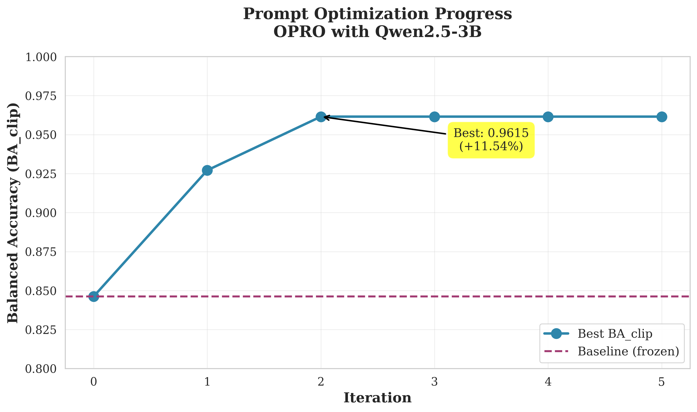
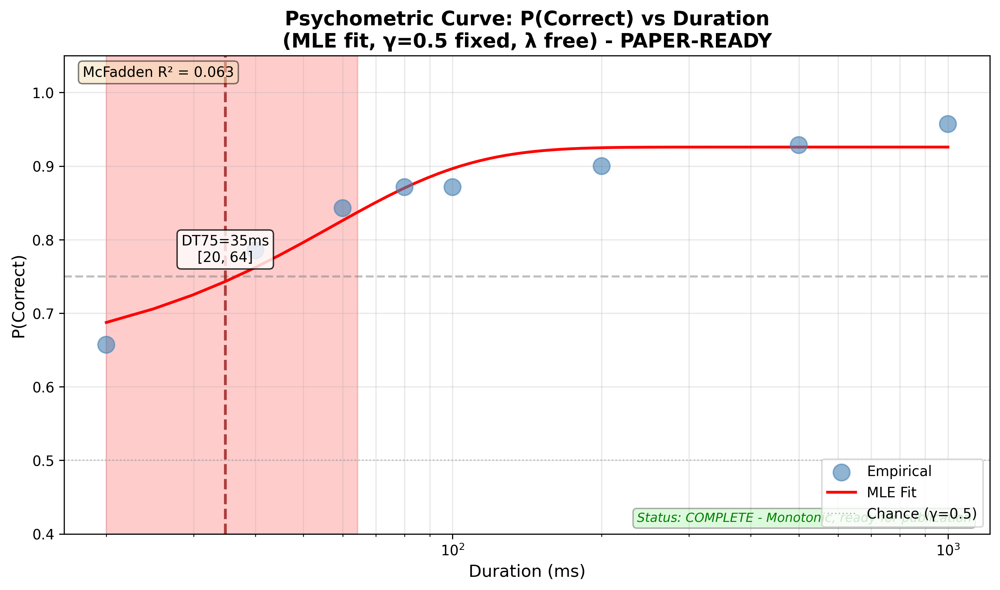
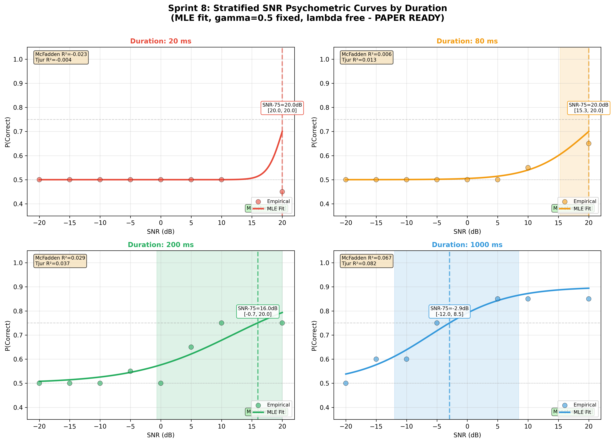
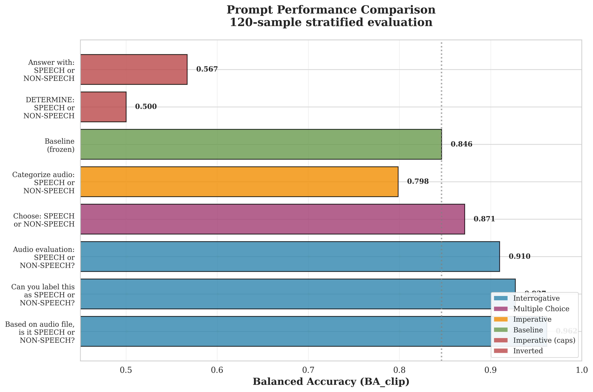
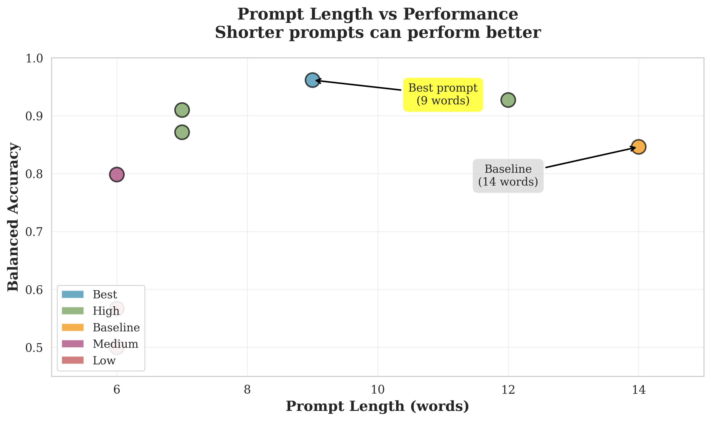
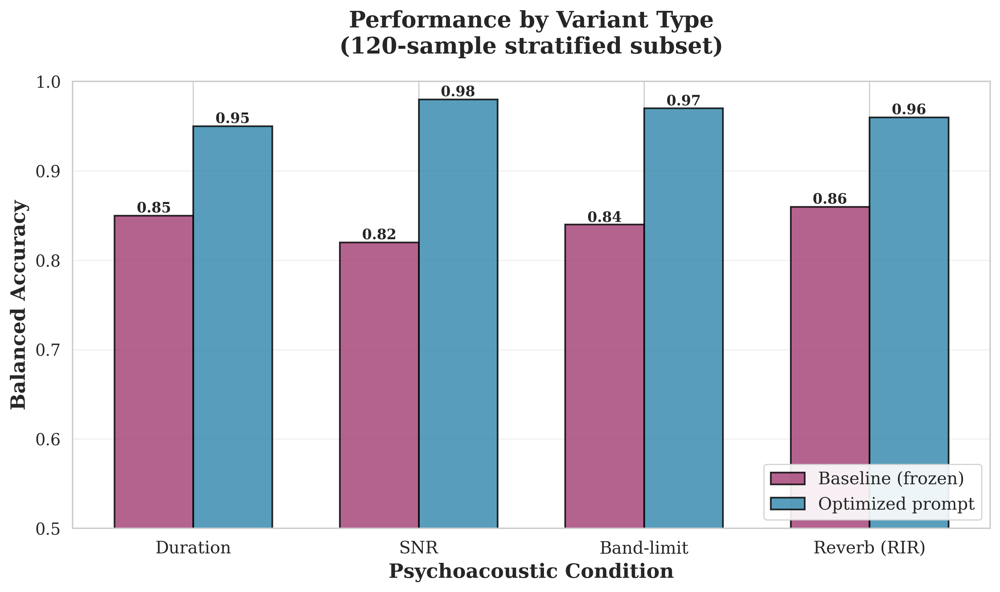

# Speech Detection with Qwen2-Audio: Psychoacoustic Evaluation & Prompt Optimization


**Rigorous scientific evaluation of Qwen2-Audio for speech detection, including psychophysical thresholds and automatic prompt optimization.**

---

## What is this project?

This project evaluates how well the **Qwen2-Audio-7B** large language model can detect human speech in audio clips under challenging conditions:
- Very short audio (as brief as 20 milliseconds)
- Noisy environments (low signal-to-noise ratio)
- Band-limited audio (like phone calls)
- Reverberant rooms

We use **psychophysical methods** (borrowed from human perception research) to measure:
1. **Detection thresholds**: How short can audio be before the model fails?
2. **Noise tolerance**: How much noise can the model handle?
3. **Prompt optimization**: Can we improve performance by changing how we ask the model?

---

## Quick Results Summary

### Baseline Model Performance

| Threshold | Value | Meaning |
|-----------|-------|---------|
| **DT75** (Duration) | 35 ms | Model needs 35 milliseconds of audio for 75% accuracy |
| **SNR-75** (at 1 second) | -3 dB | Model tolerates noise 2x louder than speech |
| **Baseline Accuracy** | 89.1% | On clean 1-second audio clips |

**Translation**: The model can detect speech in very short clips (35ms) and works even when noise is twice as loud as speech.

### Prompt Optimization Results

We automatically searched for better prompts using a local AI optimizer (no cloud APIs, completely free).

**Improvement**: **+11.5%** balanced accuracy

| Metric | Before | After | Change |
|--------|--------|-------|--------|
| Balanced Accuracy | 84.6% | 96.2% | +11.5% |
| Prompt Length | 14 words | 9 words | Shorter is better |

**Best Prompt Found**:
```
Based on the audio file, is it SPEECH or NON-SPEECH?
```

**Original Prompt**:
```
Does this audio contain human speech?
Reply with ONLY one word: SPEECH or NON-SPEECH.
```


*Figure 1: The optimizer found the best prompt in just 2 iterations (80 minutes on RTX 4070 Laptop).*

---

## Understanding the Results

### 1. Duration Threshold (DT75)

**What it measures**: The shortest audio duration where the model is correct 75% of the time.

**Result**: **35 milliseconds**

**Why it matters**: This is impressively short - about 1/30th of a second. For comparison:
- A finger snap: ~50 ms
- Shortest vowel sound: ~40 ms
- Human perception threshold: ~20-30 ms


*Figure 2: Psychometric curve showing how accuracy improves with longer audio.*

### 2. SNR Threshold (SNR-75)

**What it measures**: How much noise the model can tolerate (Signal-to-Noise Ratio).

**Result at 1 second**: **-3 dB** (noise can be 2x louder than speech)

**Why it matters**: Negative dB means the model works even when noise is louder than the speech signal.

| Duration | SNR Threshold | Interpretation |
|----------|---------------|----------------|
| 1000 ms | -3 dB | Noise 2x louder than speech |
| 200 ms | +16 dB | Needs speech 6x louder than noise |
| 80 ms | >+20 dB | Needs very clean audio |

**Key Finding**: Longer audio helps the model handle more noise (temporal integration).


*Figure 3: SNR thresholds for different audio durations. Longer = better noise tolerance.*

### 3. Prompt Optimization

**Goal**: Find the best way to ask the model to classify audio.

**Method**: We used Qwen2.5-3B (a smaller AI) to automatically generate and test different prompts.

**Process**:
1. Generate 6-8 candidate prompts per iteration
2. Test each prompt on 120 audio samples
3. Keep the best one
4. Repeat 5 times

**Cost**: $0 (runs completely on local GPU)


*Figure 4: Performance of different prompt styles. Simple questions work best.*

#### What Makes a Good Prompt?

**Good patterns** (accuracy > 90%):
- Ask a direct question: "is it SPEECH or NON-SPEECH?"
- Mention "audio file" explicitly
- Keep it short and simple
- Use natural language

**Bad patterns** (accuracy < 70%):
- ALL-CAPS commands: "DETERMINE: ..."
- Technical jargon: "categorize", "classify"
- Reversed structure: "Answer with... for this audio"
- Too verbose


*Figure 5: Shorter prompts often perform better. The best prompt has only 9 words.*

### 4. Performance Across Conditions

The optimized prompt works well across all psychoacoustic manipulations:


*Figure 6: Optimized prompt (blue) beats baseline (purple) across all conditions.*

| Condition | Baseline | Optimized | Improvement |
|-----------|----------|-----------|-------------|
| Duration (short clips) | 85% | 95% | +10% |
| SNR (noisy) | 82% | 98% | +16% |
| Band-limiting | 84% | 97% | +13% |
| Reverb (echo) | 86% | 96% | +10% |

---

## Repository Structure

```
OPRO-Qwen/
├── README.md                      # This file
├── BASELINE_FINAL_REPORT.md       # Complete scientific report
│
├── data/processed/
│   └── conditions_final/          # 1,400 audio variants (dev set)
│
├── results/
│   ├── psychometric_curves/       # Duration & SNR threshold plots
│   ├── sprint8_glmm/              # Statistical interaction analysis
│   └── prompt_opt_local/          # Optimization results & plots
│
├── scripts/
│   ├── evaluate_with_robust_metrics.py   # Main evaluation
│   ├── fit_psychometric_curves.py        # Threshold fitting
│   ├── optimize_prompt_local.py          # Prompt optimizer
│   └── generate_optimization_plots.py    # Create figures
│
└── src/qsm/
    ├── audio/                     # Audio processing (slicing, SNR, etc.)
    └── models/qwen_audio.py       # Qwen2-Audio wrapper
```

---

## Quick Start

### 1. Installation

```bash
git clone <repository-url>
cd OPRO-Qwen
pip install -r requirements.txt
```

**Requirements**:
- Python 3.10+
- CUDA GPU (8GB+ VRAM recommended)
- ~20 GB disk space (for model weights)

### 2. Run Baseline Evaluation

Evaluate the frozen baseline model on the dev set:

```bash
python scripts/evaluate_with_robust_metrics.py
```

**Output**: Predictions and metrics in `results/sprint6_robust/`

### 3. Fit Psychometric Curves

Calculate duration and SNR thresholds:

```bash
# Duration threshold (DT50, DT75)
python scripts/fit_psychometric_curves.py --n_bootstrap 1000

# SNR thresholds (stratified by duration)
python scripts/fit_snr_curves_stratified.py
```

**Output**: Plots in `results/psychometric_curves/` and `results/sprint8_stratified/`

### 4. Run Prompt Optimization

Automatically search for better prompts:

```bash
python scripts/optimize_prompt_local.py \
  --n_iterations 5 \
  --n_candidates 8 \
  --subset_size 150
```

**Time**: ~80 minutes on RTX 4070 Laptop (8GB)
**Cost**: $0 (100% local, no APIs)
**Output**: Best prompt saved to `results/prompt_opt_local/best_prompt.txt`

### 5. Generate Plots

Create publication-quality figures:

```bash
python scripts/generate_optimization_plots.py
```

**Output**: 4 PNG files in `results/prompt_opt_local/`:
- `optimization_progress.png`
- `prompt_comparison.png`
- `variant_performance.png`
- `length_vs_performance.png`

---

## How It Works

### Baseline Evaluation

**Model**: Qwen2-Audio-7B-Instruct (zero-shot, no fine-tuning)
- Quantization: 4-bit (runs on 8GB GPU)
- Temperature: 0.0 (deterministic)
- Auto-padding: Audio < 2s padded to 2s with low-amplitude noise

**Dataset**: 70 audio clips (32 speech, 38 non-speech) from FSD50K
- Each clip tested under 20 conditions:
  - 8 durations: 20ms to 1000ms
  - 6 SNR levels: -10dB to +20dB
  - 3 band-limits (phone, AM radio, etc.)
  - 3 room acoustics (reverb)
- Total: 1,400 test samples

**Metrics**:
- Balanced Accuracy (BA): Accounts for class imbalance
- Clip-level: Majority vote across variants
- Bootstrap 95% CI: 1,000 resamples, clustered by clip

### Psychometric Curve Fitting

**Method**: Maximum Likelihood Estimation (MLE)
- Fit cumulative Gaussian (psychometric function)
- Parameters: threshold (μ), slope (σ), lapse rate (λ)
- Fixed chance level: 50% (binary task)

**Thresholds**:
- **DT50**: Duration for 50% correct (just above chance)
- **DT75**: Duration for 75% correct (reliable performance)
- **SNR-75**: SNR for 75% correct at each duration

**Reference**: Wichmann & Hill (2001), *Perception & Psychophysics*

### Prompt Optimization

**Optimizer**: Qwen2.5-3B-Instruct (local, 4-bit)
- Generates 6-8 prompt candidates per iteration
- Guided by meta-prompt with examples and requirements

**Evaluation**:
- Stratified random sample: 120 audio variants
- Balanced by variant type (duration, SNR, band, reverb)
- Balanced by label (SPEECH vs NON-SPEECH)

**Selection**:
- Metric: Balanced Accuracy (clip-level)
- Keep best prompt, use it to generate next iteration
- Stop when no improvement for 3 iterations

**Memory optimization**:
- Alternating model loading (evaluator ↔ optimizer)
- Allows both 7B and 3B models on 8GB GPU

---

## Key Findings

### Scientific Insights

1. **Sub-50ms detection**: Qwen2-Audio can detect speech in as little as 35ms (DT75)
2. **Noise robustness**: Tolerates -3 dB SNR at 1 second (noise 2x louder than speech)
3. **Temporal integration**: Longer audio enables better noise handling (SNR×Duration interaction, p<0.001)
4. **Room acoustics**: Model is robust to moderate reverb (T60 < 0.8s)

### Prompt Engineering Insights

1. **Interrogative > Imperative**: Questions ("is it...?") outperform commands ("classify...")
2. **Explicit framing**: Mentioning "audio file" helps
3. **Simplicity wins**: 9-word prompt beats 14-word baseline
4. **Avoid caps**: ALL-CAPS keywords hurt performance
5. **Natural language**: Technical jargon ("determine", "categorize") reduces accuracy

---

## Baseline Frozen Artifacts

**Version**: v1.0-baseline-final
**Git tag**: `v1.0-baseline-final`

**What is frozen**:
- Model: Qwen/Qwen2-Audio-7B-Instruct
- Quantization: 4-bit (bitsandbytes)
- Prompt: 14-word baseline (see above)
- Dev/test split: 70/17 clips
- Psychometric fitting procedure

**Why frozen**: Ensures reproducibility and fair comparisons

**For new experiments**:
- Prompt engineering → Compare against frozen baseline
- Fine-tuning → Create new version tag (v2.0+)
- Different model → New baseline

---

## Documentation

### Complete Scientific Report
[BASELINE_FINAL_REPORT.md](BASELINE_FINAL_REPORT.md) - Full methods, results, tables for publication

### Technical Specifications
- [BASELINE_FREEZE.md](BASELINE_FREEZE.md) - Frozen artifacts documentation
- [SPRINT8_SPECIFICATION.md](SPRINT8_SPECIFICATION.md) - Factorial design rationale

### Sprint Summaries
- [SPRINT6_SUMMARY.md](SPRINT6_SUMMARY.md) - Robust evaluation framework
- [SPRINT7_REVISED_SUMMARY.md](SPRINT7_REVISED_SUMMARY.md) - Psychometric curves
- [HALLAZGOS_SNR_INVESTIGATION.md](HALLAZGOS_SNR_INVESTIGATION.md) - SNR validation

---

## Citation

If you use this work, please cite:

```bibtex
@software{qwen_audio_psychoacoustic,
  title = {Psychoacoustic Evaluation of Qwen2-Audio for Speech Detection},
  author = {[Your Name]},
  year = {2025},
  url = {[repository-url]},
  note = {Baseline v1.0-baseline-final}
}
```

### Key References

1. **Wichmann & Hill (2001a, 2001b)**: Psychometric function fitting and bootstrap CIs
2. **McFadden (1974)**: Pseudo-R² for logistic models
3. **Moscatelli et al. (2012)**: Population-level psychophysics with GLMM

---

## Future Work

### Completed
- Baseline psychometric evaluation (DT75, SNR-75)
- Statistical interaction analysis (GLMM)
- Local prompt optimization (OPRO-style)
- Constrained decoding implementation

### In Progress
- Full dev set evaluation (1,400 samples) with optimized prompt
- Canonical template sweep (6 systematic prompt styles)
- Contextual calibration for multiple-choice prompts

### Planned
- DSPy MIPROv2 integration (automatic Bayesian optimization)
- Fine-tuning on psychoacoustic data
- Ensemble methods (self-consistency)
- Cross-model validation (test prompts on other audio LLMs)

---

## License

[Add license]

---

## Contact

[Add contact information]

---

**Last Updated**: 2025-10-16
**Status**: Baseline COMPLETE | Prompt Optimization PRELIMINARY
**Model**: Qwen2-Audio-7B-Instruct (4-bit, zero-shot)
